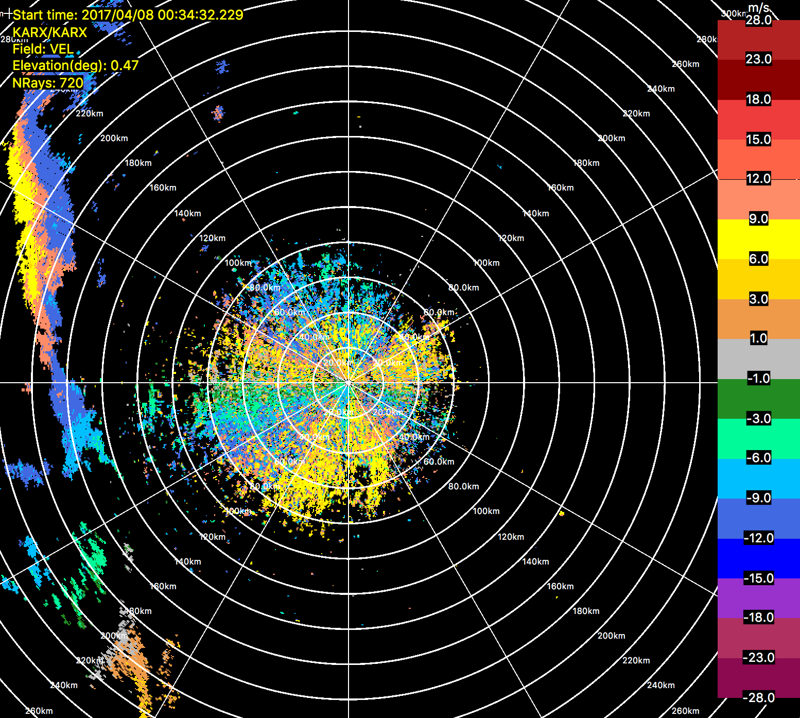
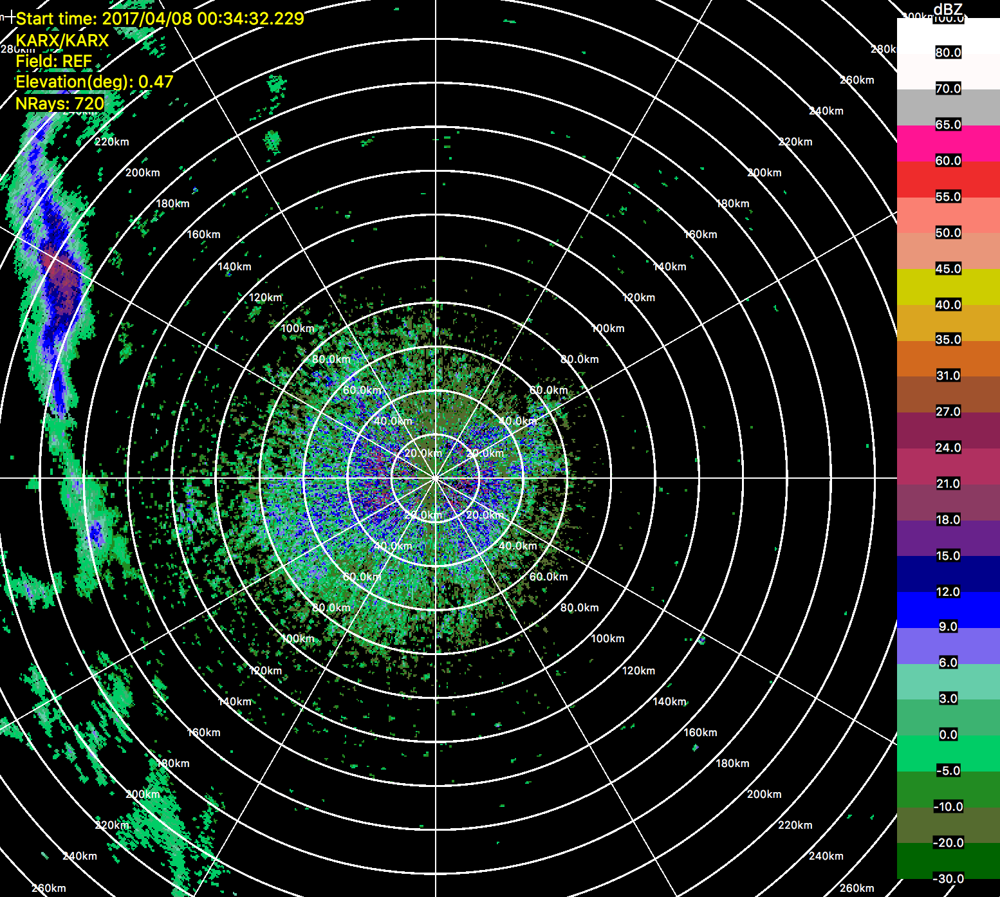
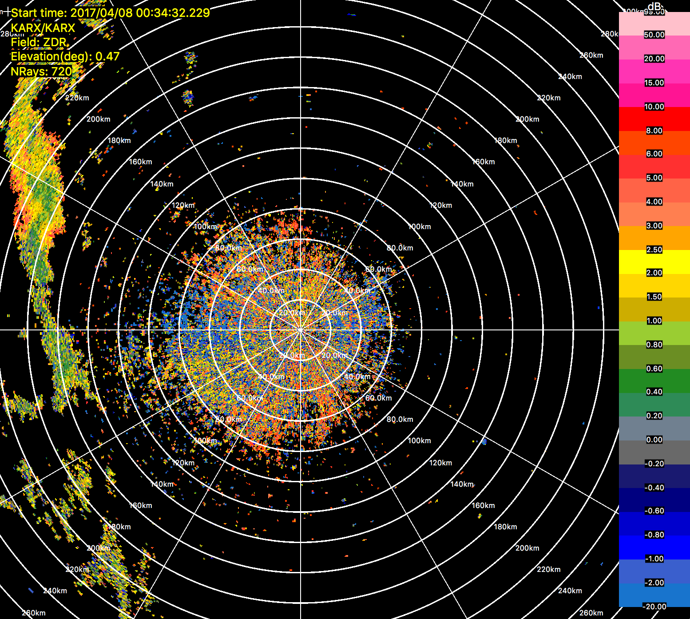

     

This example uses raw level II NEXRAD data from KARX in La Crosse, WI.  
LROSE tools convert the data to CfRadial format (RadxConvert), 
print the data for a quick sanity check (RadxPrint),
display the data using HawkEye, then save the field variables as PNG images.

## 1. Grab a NEXRAD data file from 
https://s3.amazonaws.com/noaa-nexrad-level2/index.html

I clicked on  KARX20170408_003319_V06 and it downloaded the data file.

## 2. Convert to CfRadial format

$ ./RadxConvert -f /Users/brenda/Downloads/KARX20170408_003319_V06

## 3. Quick sanity check

$ ./RadxPrint -f output/20170408/cfrad.20170408_003432.229_to_20170408_004300.205_KARX_Surveillance_SUR.nc

notice these fields ...

    field[0]: REF
    field[1]: VEL
    field[2]: ZDR
    field[3]: REF_s1
    field[4]: REF_s3

add them to the HawkEye.params file ...

## 4. Display

get the color scales needed by HawkEye 

$ git clone https://github.com/NCAR/lrose-displays

$ ./HawkEye -print_params > $HOME/example1/HawkEye.params

edit the params file ...
set location of the color scales
color_scale_dir = "$(HOME)/ncar/work/git/lrose-displays/color_scales";
add the fields 
 [There are many other settings in the parameter file](other-hawkeye-params.md)
 
 start HawkEye to display the data ...

$ ./HawkEye -params ~/test_area/hawkeye/HawkEye_KARX.archive -f output/20170408/cfrad.20170408_003432.229_to_20170408_004300.205_KARX_Surveillance_SUR.nc

## 5. Save field variables as PNG files
